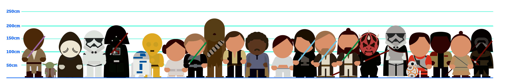
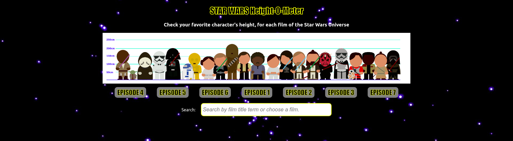
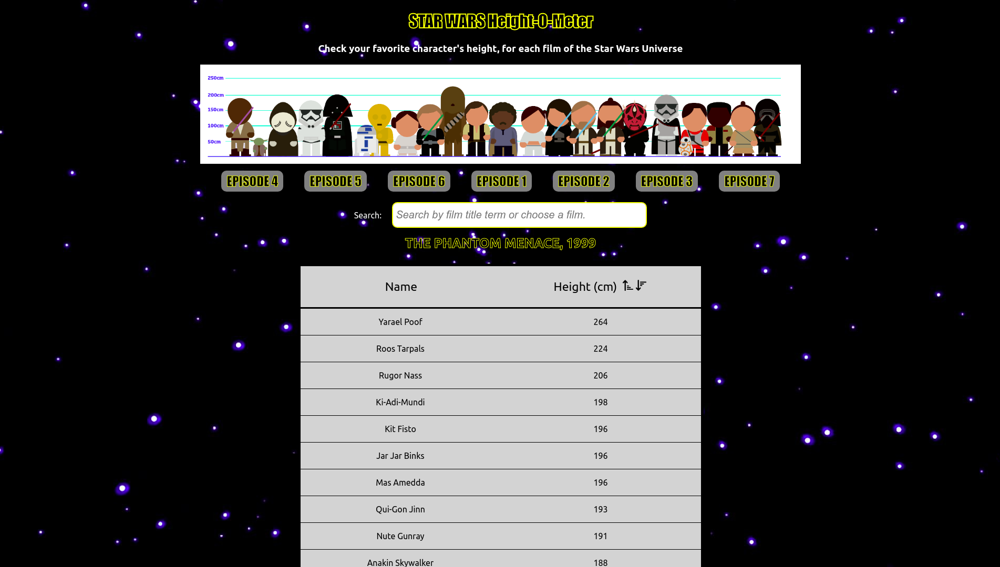
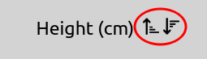

# STAR WARS Height-o-Meter Backend

### This is the frontend for STAR WARS characters height comparison website.



## Table of contents

- Installation
- Framework/technologies
- Usage
- APIs/Packages references

## Installation

- Step 1 : Clone this repository
- Step 2 : Go to the project directory and install dependencies

```javascript
$ cd projectFolder

$ npm install
```

- Step 3 : Run the app with npm

```javascript
$ npm start
```

## Framework and technologies used

### Frontend

- This project was created with [ReactJS](https://reactjs.org/) framework
- Technologies : [redux](https://www.npmjs.com/package/redux), [redux-thunk](https://www.npmjs.com/package/redux-thunk), [superagent](https://www.npmjs.com/package/superagent)

### Backend

For details visit the [Backend repository](https://github.com/krik-chry/star-wars-assignment-server)

## Usage

### The user can check their favorite character's height, for each film of the Star Wars Universe.

On load, all movies are fetched from the SWAPI API and are listed as Star Wars Episodes. The user can click them to get the episode's characters, or search for a film by title term.



Then a list of characters shows up with all the characters sorted by height.



Default is descending, but there are sorting buttons to change it to ascending, or back to descending

<p align='center'>

</p>

## APIs references

The API used for this project is [SWAPI](https://swapi.co/) API

For more information, feel free to contact me.
